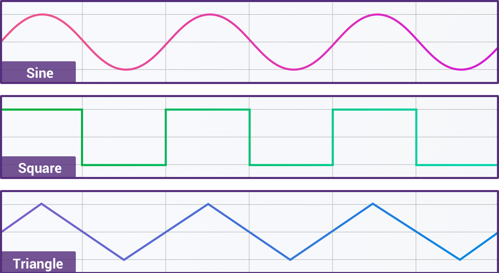

- title : FSharp Audio Workshop
- description : An introduction to digital audio with FSharp
- author : John Stovin
- theme : moon
- transition : convex

*** 

# FSharp Audio Workshop

### John Stovin


@johnstovin

### FSharp Exchange / London / 6 April 2018

' Gauge the audience:
' * F# experience level?
' * Digital audio knowledge?

---

This is a workshop with 2 halves:

1. Generating sounds
2. Responding to asynchronous inputs


***

## What is sound?

Regular back & forth displacement of air molecules

-> Moves your eardrum

-> Stimulates aural nerves

-> _Something_ happens in your brain

-> Perception of _sound_

---

## How can we capture sound?

Microphone:

* electro-mechanical device
* turns vibration into electrical signal

---

## Audio waveform example

]

* y-axis - voltage (+/- around 0)
* x-axis - time

---

## Observations

1. _Loudness_ corresponds to peak-to-peak voltage
2. _Pitch_ corresponds to peak-to-peak frequency

' Electronic circuits are designed to work correctly (linearly) within certain tolerance ranges. If the voltage level of the input signal exceeds the designed level, the output will not be be a true reflection of the input. This is distortion.

' Amplifiers will often distort by clipping. The output will be clamped at a maximum level even if the input changes. So we try to keep our signals within a constrained dynamic range.

---

## Example waveforms



' Note that sine wave sounds 'purer' that the other waveforms - will explore this later

---

## Digital recording

_Sample_ the analogue signal at regular intervals

Convert the instantaneous voltage into a number between 0 and some limit (+/- 32767 - 8-bit) - _Quantisation_, _A/D Conversion_

' More bits -> higher accuracy, better quality reproduction

Store the sequence of numbers generated

For playback - regenerate instantaneous voltage synchronised to clock - _D/A Conversion_

---

## Digital Synthesis

Generate sequences of samples algorithmically, then perform D/A conversion

' In reality, we prefer floating point values - it makes computation easier - then we convert them to fixed point at the last minute

***

## Let's get coding!

' I prefer VSCode with Ionide plugins
' Create a new folder
' Open folder in VSCode
' Ctrl+Shift+P - F#: New Project - type: console - call it AudioWorkshop
'   Gives us a new project with Fake & Paket
' `git init` if you want to
' open console (Ctrl+Shift+') - cd to AudioWorkshop and `dotnet run`

---

## Audio library

We'll use **NAudio**: <https://github.com/naudio/NAudio>

' open the project file
' Ctrl+Shift+P - Paket: Add Nuget Package (to current project)
' NAudio
' Adds the dependency to the current project

---

## Implementing a provider

' snippet aud1

' NAudio needs a callback
' You do this by implementing the `IWaveProvider` interface
' Tells NAudio about the structure of the data you'll be giving it.
' Asks you to fill a buffer when more samples are needed

' There's a for loop and a mutable index
' Note the |> operator in main

***

## Generalising

Let's change this to provide an arbitrary set of samples and have the system play them

' snippet aud2 - replace everything

---

## Sidenote

Random access in lists is really expensive

' I originally implemented AudioSample as float list
' F# can't traverse the list to the end fast enough
' change it and show what happens

---

## Lazy evaluation

I don't want to have to define my entire sound before I play it

`seq` is F#'s wrapper around `IEnumerable`

Let's reimplement...

' snippet aud3

Note the use of an _Active Pattern_ in the output function

`makeNoise` uses a recursive  _seq compehension_ to generate an infinite lazy sequence of random values

' snippet aud3a

We can use `take` to create a finite sequence from our infinite sequence

***

## More complex signals -  Sinewave

' snippet aud4

We need to introduce _frequency_ (f) - how often the waveform repeats per second

To generate a repeating waveform we also need _phase_

---

## Phase illustrated

<section>
<iframe width="854" height="480" src="https://www.youtube.com/embed/miUchhW257Y" frameborder="0" allow="autoplay; encrypted-media" allowfullscreen></iframe>
</section>

---

## Phase

An angle in the range 0 .. 2π _radians_

' Math library uses radians, so we do too

1 complete revolution every 1/f seconds

The change in phase from one sample to the next we will call _delta_

The current _phase angle_ will be called _theta_

The amplitude is calculated as _sin theta_

---

## Higher order functions

``` fsharp
let TWOPI = 2.0 * Math.PI

let makeSine sampleRate frequency =
    let delta = TWOPI * frequency / float sampleRate
    let gen theta = Some (Math.Sin theta, (theta + delta) % TWOPI)
    Seq.unfold gen 0.0
```

In functional languages, we don't like write our own loops.

The standard library provides functions that allow us to provide repeated operations. Many of these are _higher order functions_ - functions that take other functions as an argument.

`Seq.unfold` generates `seq<'T>`. It takes an initial state and a function.

The function signature is `'State -> ('T * 'State) option`

If the function returns `None`, the sequence terminates.

If it returns `Some ('T * 'State)`, the `'T` value is appended to the sequence, and the function is called again with the new value of `'State`.

---

### Squarewave

We can create a function to generate a square wave.

If theta < π, the value is -1.0, otherwise it is +1.0

We can create a new function to generate squarewaves by substituting our square function for Math.Sin

---

### Refactoring to higher order functions

' snippet aud4a

``` fsharp
let sampleRate = 44100

let generate fn sampleRate frequency =
    let delta = TWOPI * frequency / float sampleRate
    let gen theta = Some (fn theta, (theta + delta) % TWOPI)
    Seq.unfold gen 0.0

let makeSine = generate Math.Sin sampleRate

let makeSquare =
    let square theta =
        if theta < Math.PI then -1.0 else 1.0
     generate square sampleRate

let makeSawtooth =
    let sawtooth theta =
        (theta / Math.PI) - 1.0
    generate sawtooth sampleRate
```

We can refactor the code duplication to a higher-order function that takes our generator function as an argument

If we make the generator function the first argument we can use partial application to generate a family of sound generator functions

---

## Karplus-Strong

Developed in the early 1980s. This is a simple algorithm to generate plucked or hammered instrument sounds

``` fsharp
let pluck sampleRate frequency =
    // frequency is determined by the length of the buffer
    let bufferLength = sampleRate / int frequency
    // start with noise
    let buffer = makeNoise |> Seq.take bufferLength |> Seq.toArray
    // go round the buffer repeatedly, playing each sample
    // then averaging with previous and decaying
    let gen index =
        let nextIndex = (index + 1) % bufferLength
        let value = buffer.[nextIndex]
        buffer.[nextIndex] <- (value + buffer.[index]) / 2.0 * 0.996
        Some(value, nextIndex)

    Seq.unfold gen (bufferLength - 1)
```

' snippet aud5

***

## Modulation

Can we produce vibrato?

Need to be able to change the frequency of our oscillator over time. The obvious way to do this is to make the frequency parameter a stream.

```fsharp
let generate fn sampleRate (frequency : AudioStream) = 
    let enumerator = frequency.GetEnumerator()
    let gen theta =
        let f = if enumerator.MoveNext() then enumerator.Current else 0.0
        let delta = TWOPI * f / float sampleRate
        Some (fn theta, (theta + delta) % TWOPI)
    Seq.unfold gen 0.0

let Constant value =
    Seq.unfold (fun _ -> Some(value, ())) ()

let sin440 = makeSine (Constant 440.0)
```

' snippet aud6

---

## Vibrato

We need a stream that varies between 420.0 - 460.0, at 3 Hz

``` fsharp
let vibrato =
    let sin = makeSine (Constant 3.0)
    sin |> Seq.map (fun x -> (x * 20.0) + 440.0)

let wobblySine =
    vibrato |> makeSine
```

' snippet aud6a

---

## A bit of refactoring

Lets generalise the vibrato parameters and pass them in

``` fsharp
let gain seq1 seq2 =
    Seq.zip seq1 seq2 |> Seq.map (fun (a, b) -> a * b)

let offset seq1 seq2 =
    Seq.zip seq1 seq2 |> Seq.map (fun (a, b) -> a + b)

let vibrato =
     makeSine (Constant 3.0) |> gain (Constant 20.0) |> offset (Constant 440.0)
```

' snippet aud6b

---

### More refactoring

Extract the obvious common code

``` fsharp
let zipMap fn seq1 seq2 =
    Seq.zip seq1 seq2 |> Seq.map (fun (x, y) -> fn x y)

let gain =
    zipMap (*)

let offset =
    zipMap (+)
```

' snippet aud6c


***

## Input

First thought - use the computer keyboard

Unfortunately console applications only support 'key press' events

We can't distinguish between 'key down' and 'key up' events

So we have to use MIDI

---

## MIDI

MIDI (_Musical Instrument Digital Interface_) is a protocol for controlling musical interfaces, originally across a dedicated hardware bus, but now over a variety of transports.

My keyboard transmits MIDI over USB.

NAudio has a MIDI support.

---

We need an input library: `NAudio` again

``` fsharp
let getInDevice () = 
    let deviceRange = [0.. MidiIn.NumberOfDevices-1]
    match deviceRange |> List.tryFind (fun n -> MidiIn.DeviceInfo(n).ProductName = "MPKmini2") with
    | Some id -> 
        printfn "Play some music"
        Some (new MidiIn(id))
    | None -> 
        printfn "You forgot to plug in the keyboard"
        None
```

' snippet aud7

---

We also need to change our program to run continuously:

to make life easier we will terminate on a key press

``` fsharp
let waitForKeyPress () = 
    let mutable goOn = true
    while goOn do
        let key = Console.ReadKey(true)
        if key.KeyChar = ' ' 
        then 
            goOn <- false
```

' snippet aud8

***

## Reactive Programming

' Who here knows about Rx?

' Who has used it?

One of the great features of FSharp is that events also implement IObservable. This means that you have the power of Rx available automatically.

Rx gives you the power to compose events in the same way that IEnumerable allows you to compose sequences.

---

`IObservable<T>` is the semantic dual of `IEnumerable<T>`

`IObservable<T>.Subscribe()` <-> `IEnumerable<T>.GetEnumerator()`

`IObserver` is the semantic dual of `IEnumerator`

`IObserver.OnNext(T)` <-> `IEnumerator.MoveNext()`

`IObserver.OnError(Exception)` <-> `IEnumerator.MoveNext()` throws

`IObserver.OnEnded()` <-> `IEnumerator.MoveNext()` returns `false`

***

## Let's get Reactive

Let's try to make this sound generator playable by responding to user input.

---

## MIDI Notes

Part of the MIDI protocol covers musical notes. By default it assumes the standard _equal-tempered_ scale. 

Each semitone is mapped onto a _note number_ in the range 0-127. _Middle C_ is 60. Concert A (440 Hz) is 69.

Each note message also has a _velocity_ part (how hard the key is hit). Lifting a key either sends a Note Off message, or another Note On message with a velocity of 0.

---

## Calculating frequency from note number

Standard Concert A is 440 Hz

This is note number 69.

Pitch is an exponential scale - frequency double every octave

There are 12 equally spaced semitone in an octave.

moving from one semitone to the next increases the frequency by the 12th root of 2 : `2 ^ (1 / 12)`

``` fsharp
    let noteNumberToFrequency noteNumber =
        match noteNumber with
        | 0 -> 0.0
        | _ -> Math.Pow(2.0, (float (noteNumber-69)) / 12.0) * 440.0
```

' snippet aud8

---

## Transforming events

The `MidiIn` object exposes an event called `MessageReceived`. It has the type `MidiInMessageEventArgs`.

We would like to use something more meaningful.

First filter to a MidiEvent:

``` fsharp
let midiEvents (evt : IObservable<MidiInMessageEventArgs>) =
    evt |> Observable.map (fun e -> e.MidiEvent)
```

' snippet aud9a

Then ignore any events that aren't note events:

``` fsharp
let noteEvents (evt : IObservable<MidiEvent>) =
    evt |> Observable.filter (fun e -> e :? NoteEvent)
    |> Observable.map (fun e -> e :?> NoteEvent)
```

'snippet aud9b

`Observable` allows us to treat events just like sequences.

---

## Handling note off

Recall that Note Off messages can take 2 forms - either a true Note Off, or a Note On with a velocity of 0.

This is an ideal candidate for _Active Patterns_:

``` fsharp
let (|NoteOff|_|) (evt : NoteEvent) =
    match evt.CommandCode, evt.Velocity with
    | MidiCommandCode.NoteOff, _ -> Some evt
    | MidiCommandCode.NoteOn, 0 -> Some evt
    | _, _ -> None

let (|NoteOn|_|) (evt : NoteEvent) =
    match evt.CommandCode, evt.Velocity with
    | MidiCommandCode.NoteOn, v when v > 0 -> Some evt
    | _, _ -> None
```

' snippet aud10

---

Lets transform our sequence of discrete note events into a continuous stream of frequency values:

``` fsharp
let noteStream (evt : IObservable<NoteEvent>) =
    let mutable note = 0

    evt.Add(fun event ->
        note <- match event with 
                | NoteOff _ ->  0
                | NoteOn n -> n.NoteNumber
                | _ -> note)

    Seq.unfold (fun _ -> Some(noteNumberToFrequency note, ())) ()
```

' snippet aud11

---

Putting it all together

``` fsharp
let runWith (input : MidiIn) (output : IWavePlayer) =
    input.MessageReceived |> noteStream |> makeSine |> StreamProvider |> output.Init

    output.Play ()
    input.Start ()

    waitForKeyPress ()

    output.Stop ()
    input.Stop ()

[<EntryPoint>]
let main _ =
    match getInDevice () with
    | None -> -1
    | Some input -> 
        runWith input (new WasapiOut(AudioClientShareMode.Shared, 1))
        0
```

' snippet aud12

***

## Adding some interest

Can we dynamically modulate our sound as we play?

Yes - because we have _MIDI Controls_

---

## MIDI Controls

MIDI supports 127 control devices.

Each control can send control change events with a value in the range 0-127.

We can map those control change values onto out vibrato frequency and depth.

---

First we need to refactor `wobblySine` to take some parameters

``` fsharp
let vibrato depth modulation freq =
    makeSine modulation |> gain depth |> offset freq

let wobblySine depth modulation freq =
    vibrato depth modulation freq |> makeSine
```

' snippet aud13

Don't forget: these functions are in the domain of _streams_, not individual values

---

Lets create a function to filter the MIDI control events by controller id

``` fsharp
let controlStream controller (evt : IObservable<MidiInMessageEventArgs>) = 
    let mutable controlValue = 0

    evt.Add(fun msg ->
        controlValue <- match msg.MidiEvent with
                        | :? ControlChangeEvent as ctrl -> 
                            if int ctrl.Controller = controller
                            then ctrl.ControllerValue
                            else controlValue
                        | _ -> controlValue
        )

    Seq.unfold (fun _ -> Some(float controlValue, ())) ()
```

' snippet aud14

---

And update `runWith` accordingly:

``` fsharp
let runWith (input : MidiIn) (output : IWavePlayer) =
    let depth = input.MessageReceived |> (controlStream 1)
    let modulation = input.MessageReceived |> (controlStream 2)
    input.MessageReceived |> noteStream |> (wobblySine depth modulation) |> StreamProvider |> output.Init

    ...
```

' snippet aud15

***

## Triggering sound events

Up to now we've modified a stream as it plays.

This won't work for the _pluck_ algorithm we used earlier. That doesn't play forever - it has a start and fades out.

We need to find a way to _trigger_ audio streams and then merge them into the playback stream.

---

Let's assume we can generate an Observable sequence of audio streams.

Each time we get a new event, we'll stop playing the previous stream and start playing the current one.

We have to decompose the fsharp seq to an IEnumerator.

``` fsharp
let merge (strm : AudioStream) (evt: IObservable<AudioStream>) =
    let mutable enumerator = strm.GetEnumerator()
    let nextValue () = if enumerator.MoveNext() then enumerator.Current else 0.0

    evt.Add (fun msg -> enumerator <- msg.GetEnumerator())

    Seq.unfold (fun _ -> Some(nextValue (), ()) ) ()
```

' snippet aud16

---

We need to turn an observable stream of Note events into an observable stream of audio streams.

- Filter only note on events
- Map to observable seq of frequency
- Map from frequency to audio stream 
- merge with an initial stream of silence

``` fsharp
let trigger (generator: float -> AudioStream) (trig: IObservable<NoteEvent>) : AudioStream =
    let noteOns = trig |> Observable.filter (fun evt -> evt :? NoteOnEvent && evt.Velocity > 0)
    let freqs = noteOns |> Observable.map (fun evt -> noteNumberToFrequency evt.NoteNumber)

    let streams = freqs |> Observable.map generator

    let initial = Constant (0.0)
    merge initial streams
```

' snippet aud17

---

So now `runWith` looks like this

``` fsharp
let runWith (input : MidiIn) (output : IWavePlayer) =
    let events = input.MessageReceived |> midiEvents |> channelFilter 1
    let notes = events |> noteEvents
    notes |> trigger (pluck sampleRate) |> StreamProvider |> output.Init

    ...
```


Now we can do this, we can play any audio stream - the basis of _sampling_

***

## Final thoughts

We have a framework for a functional approach to audio synthesis.

We can extend this in lots of ways:

- _Filters_ and _envelope generators_ to give all the features of basic synthesizers.

- Other synthesis algorithms (e.g. FM, sample playback).

- Extend key handling to provide _polyphony_.

- _VST_ support to plug into more general audio pipelines (_Digital Audio Workstations_).

- Threading support to use the full power of modern CPUs.

- A pluggable connection mechanism to allow dynamic reconfiguration.

- Use Fable, WebMidi & WebAudio to move all this code to the browser

***

## Links

Code at https://github.com/JohnStov/fsx-audio-workshop

Slides at https://johnstov.github.io/fsx-audio-workshop

Slides produced with FsReveal: https://fsprojects.github.io/FsReveal